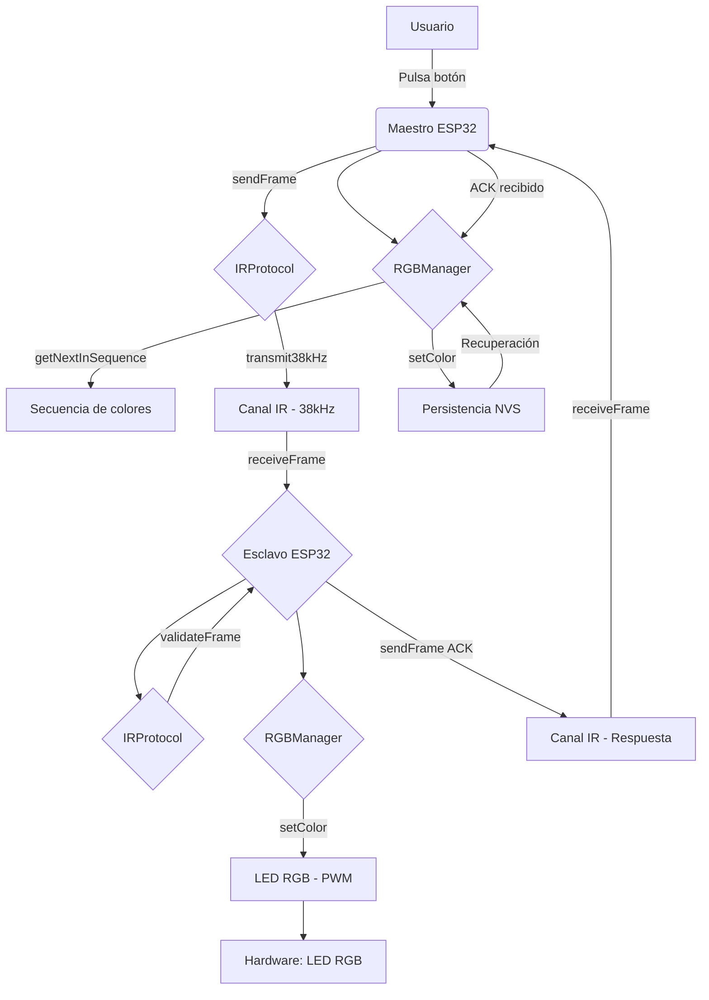
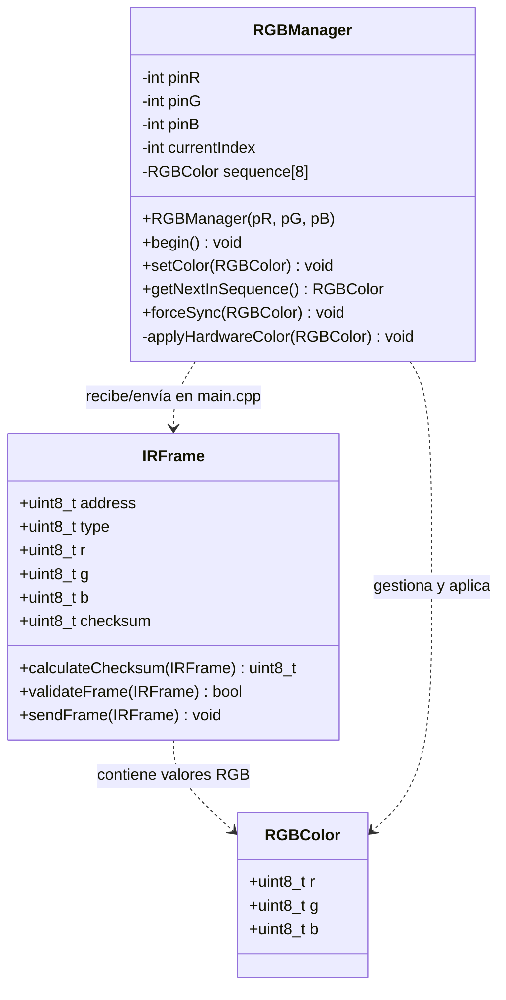
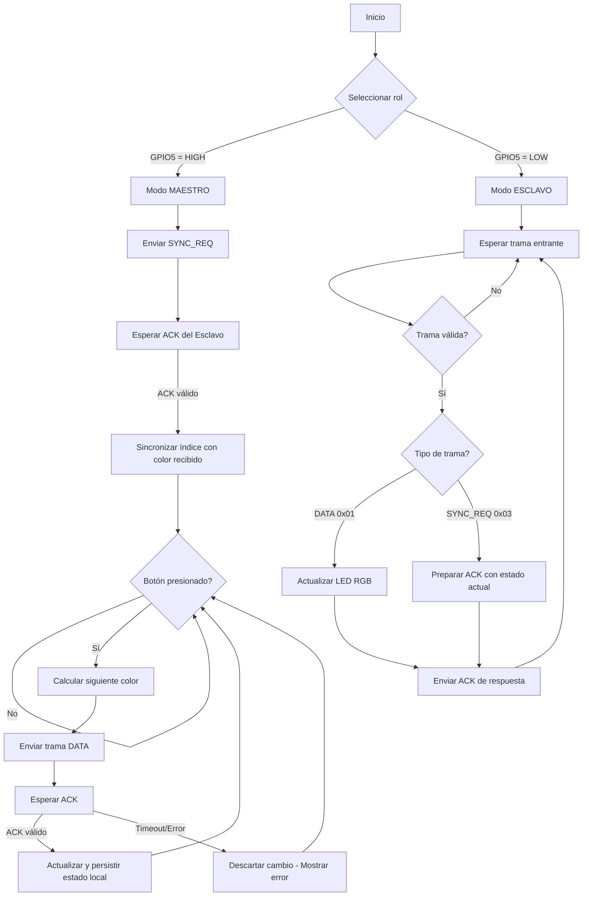

# Documentación del Sistema de Control RGB por Infrarrojos (RGB-Sync)

---

## 1. Definiciones y especificación de requerimientos

### Definición general del proyecto

El sistema **RGB-Sync** es un sistema embebido de control de iluminación RGB basado en una arquitectura **Maestro-Esclavo** que utiliza comunicación por infrarrojos (IR) como medio de transmisión. Consiste en dos nodos ESP32 que se comunican de forma bidireccional a través de un canal *half-duplex* empleando un protocolo propio de codificación por distancia de pulsos (*Pulse Distance Coding*) sobre una portadora de 38 kHz.

La funcionalidad principal del sistema es permitir que un usuario, mediante un pulsador físico conectado al nodo Maestro, recorra una secuencia predefinida de ocho colores (Rojo, Amarillo, Verde, Celeste, Azul, Lila, Blanco y Rosa) que se reflejan sincrónicamente en un LED RGB gobernado por el nodo Esclavo. El sistema incorpora un mecanismo de *handshaking* (ACK) para garantizar la integridad de la comunicación, un checksum acumulativo para detección de errores y persistencia de estado en memoria no volátil (NVS) para recuperación ante cortes de energía.

**Propósitos:**

- Implementar un sistema de comunicación digital serial por infrarrojos entre dos microcontroladores.
- Aplicar conceptos de capa física, capa de enlace y capa de sesión en un sistema real.
- Garantizar la consistencia de estado entre dos nodos mediante un protocolo de confirmación.

**Objetivos:**

- Diseñar e implementar un protocolo de trama de 48 bits con detección de errores.
- Lograr la sincronización automática del nodo Maestro con el estado del Esclavo al iniciar el sistema.
- Asegurar que el LED RGB mantenga su último estado ante ciclos de energización.

### Usuarios

- **Estudiantes y docentes de ingeniería/comunicaciones:** Usuarios con conocimientos intermedios de electrónica, sistemas embebidos y programación en C/C++. Se espera que el usuario sepa manejar entornos de desarrollo como PlatformIO y tenga nociones de conexionado de prototipos electrónicos con ESP32.
- **Entusiastas de IoT y sistemas embebidos:** Usuarios con experiencia en Arduino/ESP32 que deseen estudiar una implementación de protocolo de comunicaciones por infrarrojos.

### Especificación de requerimientos

**Requerimientos funcionales:**

| ID   | Descripción                                                                 |
|------|-----------------------------------------------------------------------------|
| RF01 | El sistema debe permitir que el usuario cambie el color del LED RGB mediante un pulsador. |
| RF02 | El sistema debe transmitir el comando de cambio de color por infrarrojos desde el Maestro al Esclavo. |
| RF03 | El Esclavo debe responder con un paquete ACK para confirmar la recepción exitosa del comando. |
| RF04 | El Maestro no debe actualizar su estado local hasta recibir el ACK del Esclavo. |
| RF05 | El sistema debe detectar errores de transmisión mediante un checksum acumulativo (módulo 256). |
| RF06 | El Esclavo debe actualizar el hardware del LED RGB al recibir un comando DATA válido. |
| RF07 | El sistema debe sincronizar el estado del Maestro con el del Esclavo al arrancar (sincronización inicial). |
| RF08 | El sistema debe persistir el último color en memoria no volátil para recuperarlo tras un reinicio. |
| RF09 | La secuencia de colores debe ser circular: Rojo, Amarillo, Verde, Celeste, Azul, Lila, Blanco, Rosa. |

**Alcance:**

- El sistema comprende dos nodos ESP32 con transmisores IR (LED IR) y receptores IR (TSOP4838).
- El alcance de comunicación está limitado a línea de vista directa (típico de IR).
- No se implementa direccionamiento de red ni múltiples esclavos.

**Limitaciones:**

- Canal half-duplex: no puede transmitir y recibir simultáneamente.
- Sin control de flujo ni retransmisión automática.
- Sin encriptación de datos.
- Dependencia de línea de vista para la comunicación IR.

### Información de autoría y Legacy

| Aspecto          | Detalle                                                    |
|------------------|------------------------------------------------------------|
| **Autor**        | Sebastián (seba1junio@gmail.com)                           |
| **Tipo**         | Proyecto original                                          |
| **Fecha**        | Mayo 2026                                                  |
| **Repositorio**  | Git (commit inicial: `7979324 first commit`)               |
| **Framework**    | Arduino sobre ESP32                                        |
| **Plataforma**   | PlatformIO                                                 |
| **Retrocompatibilidad** | No aplica (proyecto desde cero)                     |

### Procedimientos de desarrollo e instalación

#### Herramientas utilizadas

| Categoría        | Herramienta                                                |
|------------------|------------------------------------------------------------|
| **IDE**          | Visual Studio Code + PlatformIO (extensión)                |
| **Plataforma HW**| ESP32 DevKit v1 (ESP-WROOM-32)                             |
| **Framework**    | Arduino Core para ESP32 (espressif32)                      |
| **Lenguaje**     | C++ (estándar Arduino)                                     |
| **Control de versiones** | Git                                               |
| **Monitor serial** | PlatformIO Serial Monitor (115200 baud)                 |

#### Planificación

El desarrollo se estructuró en las siguientes fases:

1. **Diseño del protocolo:** Definición de la PDU de 48 bits, tipos de trama y mecanismo de checksum.
2. **Implementación de la capa física:** Generación de portadora de 38 kHz mediante *bit-banging* y codificación por distancia de pulsos.
3. **Implementación del control RGB:** Manejo de PWM en tres pines y persistencia en NVS.
4. **Implementación de la lógica Maestro-Esclavo:** Orquestación del bucle principal, handshaking y sincronización inicial.
5. **Pruebas de integración:** Validación de la comunicación bidireccional y verificación de la consistencia de estado.

#### Requisitos no funcionales

- La comunicación debe operar a 38 kHz (frecuencia portadora estándar para mandos a distancia).
- El tiempo de respuesta entre el pulsador y el cambio de color debe ser perceptiblemente inmediato (< 100 ms).
- El consumo energético debe ser compatible con alimentación USB o batería del ESP32.
- Los tiempos de *debounce* del pulsador deben ser de al menos 50 ms para evitar rebotes.

#### Obtención e instalación

**Requisitos previos:**

1. Tener instalado [Visual Studio Code](https://code.visualstudio.com/).
2. Tener instalada la extensión [PlatformIO IDE](https://platformio.org/install/ide/install-vscode).
3. Tener los controladores USB-UART del ESP32 instalados (CP210x o CH340 según el modelo).

**Pasos de instalación:**

```bash
# 1. Clonar el repositorio
git clone <url-del-repositorio> ComunicacionDatosTp2

# 2. Ingresar al directorio del proyecto
cd ComunicacionDatosTp2

# 3. Abrir el proyecto en VSCode
code .

# 4. En VSCode, PlatformIO detectará automáticamente el proyecto.
#    Haga clic en el icono de PlatformIO (hormiga) → "Build" para compilar.

# 5. Conectar el ESP32 por USB y hacer clic en "Upload and Monitor"
```

**Conexionado de hardware:**

| Componente       | Pin ESP32 |
|------------------|-----------|
| LED IR (Tx)      | GPIO 12   |
| Receptor TSOP4838 (Rx) | GPIO 13   |
| Pulsador (con pull-up) | GPIO 4    |
| Selector de rol (Maestro/Esclavo) | GPIO 5 |
| LED RGB - Canal Rojo    | GPIO 18   |
| LED RGB - Canal Verde   | GPIO 19   |
| LED RGB - Canal Azul    | GPIO 21   |

> El pin GPIO 5 debe estar en **HIGH** (3.3V o sin conectar) para modo **Maestro** y en **LOW** (GND) para modo **Esclavo**.

#### Especificaciones de prueba y ejecución

| Parámetro               | Valor                                        |
|-------------------------|----------------------------------------------|
| **Velocidad del monitor** | 115200 baud                                |
| **Velocidad de subida**   | 921600 baud                                |
| **Frecuencia de la CPU**  | 240 MHz (por defecto en ESP32)             |
| **Voltaje de operación**  | 3.3V (lógico) / 5V (alimentación USB)      |
| **Entorno de pruebas**    | Dos placas ESP32 con alimentación independiente |
| **Filtros de monitor**    | `esp32_exception_decoder`, `time`, `colorize` |

---

## 2. Arquitectura del sistema

### Descripción jerárquica

El sistema sigue una arquitectura en capas inspirada en el modelo OSI simplificado, implementada sobre dos nodos físicos con roles asimétricos (Maestro/Esclavo):

```
Capa de Aplicación (main.cpp)
        |
Capa de Presentación (RGBControl.h/.cpp)
        |
Capa de Enlace (IRProtocol.h/.cpp)
        |
Capa Física (IRProtocol.cpp - generación de 38kHz)
```

A nivel de repositorio, la estructura es monolítica con separación por archivos de cabecera e implementación:

```
src/
├── main.cpp          → Capa de sesión y aplicación
├── IRProtocol.h      → Definiciones del protocolo IR (PDU + constantes)
├── IRProtocol.cpp    → Implementación de la capa física y de enlace
├── RGBControl.h      → Interfaz del gestor RGB y estructura de color
└── RGBControl.cpp    → Implementación del control PWM y persistencia NVS
```

### Diagrama de módulos



### Descripción individual de los módulos

#### Módulo: Orquestador de Sesión (`main.cpp`)

| Aspecto          | Descripción                                                              |
|------------------|--------------------------------------------------------------------------|
| **Propósito**    | Coordina la lógica del bucle principal, la selección de rol y el handshaking. |
| **Responsabilidad** | Inicializar periféricos, detectar el rol (Maestro/Esclavo), gestionar el pulsador y orquestar el intercambio de tramas. |
| **Restricciones** | No puede transmitir y recibir simultáneamente (half-duplex).             |
| **Dependencias** | `IRProtocol.h`, `RGBControl.h`, `Arduino.h`                              |
| **Archivo**      | `src/main.cpp`                                                            |

#### Módulo: Protocolo de Comunicación IR (`IRProtocol.h` / `IRProtocol.cpp`)

| Aspecto          | Descripción                                                              |
|------------------|--------------------------------------------------------------------------|
| **Propósito**    | Implementar la capa física (modulación 38 kHz) y la capa de enlace (codificación de trama). |
| **Responsabilidad** | Generar la portadora IR mediante *bit-banging*, serializar la PDU bit a bit usando *Pulse Distance Coding*, calcular y validar el checksum. |
| **Restricciones** | La estructura `IRFrame` debe estar empaquetada (`__attribute__((packed))`) para ocupar exactamente 6 bytes contiguos. |
| **Dependencias** | `Arduino.h`                                                              |
| **Archivos**     | `src/IRProtocol.h`, `src/IRProtocol.cpp`                                  |

#### Módulo: Control RGB y Persistencia (`RGBControl.h` / `RGBControl.cpp`)

| Aspecto          | Descripción                                                              |
|------------------|--------------------------------------------------------------------------|
| **Propósito**    | Gestionar el LED RGB mediante PWM y mantener el estado en memoria no volátil. |
| **Responsabilidad** | Definir la secuencia de colores, aplicar los niveles PWM, sincronizar el índice de la secuencia y persistir/recuperar el estado en NVS. |
| **Restricciones** | Los pines PWM deben ser capaces de generar la frecuencia suficiente para el ojo humano (el ESP32 lo soporta nativamente). La secuencia tiene exactamente 8 colores. |
| **Dependencias** | `Arduino.h`, `Preferences.h` (NVS)                                       |
| **Archivos**     | `src/RGBControl.h`, `src/RGBControl.cpp`                                  |

### Dependencias externas y aspectos técnicos

| Dependencia     | Versión/Descripción                        | Justificación                                                    |
|-----------------|--------------------------------------------|------------------------------------------------------------------|
| **Arduino Core para ESP32** | Framework oficial de Espressif | Proporciona las API de GPIO, PWM (`analogWrite`), temporización (`micros`, `delayMicroseconds`) y NVS (`Preferences`) de forma estandarizada. |
| **PlatformIO**  | Entorno de desarrollo multiplataforma      | Facilita la gestión de dependencias, compilación y subida al ESP32 sin necesidad de instalar la IDE de Arduino. |
| **ESP32 DevKit**| Hardware de desarrollo                     | Ofrece conectividad WiFi/Bluetooth (no utilizada), múltiples GPIO y capacidad de procesamiento suficiente para *bit-banging* preciso a 38 kHz. |
| **NVS (Preferences)** | Biblioteca integrada en Arduino Core | Permite almacenar datos en la flash del ESP32 con una API simple, ideal para persistir el último estado RGB. |

**Decisión técnica:** Se eligió *bit-banging* (manipulación directa de pines con retardos de microsegundos) en lugar de un módulo RMT del ESP32 para tener control total sobre la temporización de los pulsos y facilitar la comprensión didáctica del protocolo. Para un entorno de producción, se recomendaría usar el periférico RMT.

---

## 3. Diseño del modelo de datos

### Modelo de datos agnóstico

El sistema maneja dos entidades de datos principales:

#### Entidad: `IRFrame` (Trama de Protocolo)

Representa la unidad de datos del protocolo (PDU). Es una estructura de 48 bits (6 bytes) empaquetados.

| Atributo   | Tipo     | Tamaño | Descripción                                           |
|------------|----------|--------|-------------------------------------------------------|
| address    | uint8_t  | 4 bits | Identificador del dispositivo destino (4 bits efectivos). |
| type       | uint8_t  | 4 bits | Tipo de trama: `0x01` = DATA, `0x02` = ACK, `0x03` = SYNC_REQ. |
| r          | uint8_t  | 8 bits | Intensidad del canal rojo (0–255).                    |
| g          | uint8_t  | 8 bits | Intensidad del canal verde (0–255).                   |
| b          | uint8_t  | 8 bits | Intensidad del canal azul (0–255).                    |
| checksum   | uint8_t  | 8 bits | Suma acumulativa `(address + type + r + g + b) & 0xFF`. |

#### Entidad: `RGBColor` (Color RGB)

Representa un color en el espacio RGB con valores de 8 bits por canal.

| Atributo | Tipo     | Descripción                      |
|----------|----------|----------------------------------|
| r        | uint8_t  | Intensidad del canal rojo (0–255). |
| g        | uint8_t  | Intensidad del canal verde (0–255). |
| b        | uint8_t  | Intensidad del canal azul (0–255). |

#### Secuencia cromática (`sequence`)

Tabla de 8 colores predefinidos:

| Índice | Color    | R    | G    | B    |
|--------|----------|------|------|------|
| 0      | Rojo     | 255  | 0    | 0    |
| 1      | Amarillo | 255  | 255  | 0    |
| 2      | Verde    | 0    | 255  | 0    |
| 3      | Celeste  | 0    | 255  | 255  |
| 4      | Azul     | 0    | 0    | 255  |
| 5      | Lila     | 255  | 0    | 255  |
| 6      | Blanco   | 255  | 255  | 255  |
| 7      | Rosa     | 255  | 192  | 203  |

### Diagrama del modelo



### Tipos de datos

| Categoría   | Descripción                                                              |
|-------------|--------------------------------------------------------------------------|
| **Entrada** | Estado del pulsador digital (HIGH/LOW) y selector de rol (GPIO 5). Datos recibidos por IR (trama IRFrame). |
| **Internos** | `currentIndex` (índice en la secuencia), valores RGB en NVS, buffer de recepción de pulsos IR. |
| **Salida**  | Señales PWM en GPIO 18, 19, 21 hacia el LED RGB. Ráfagas IR moduladas a 38 kHz en GPIO 12. Mensajes de depuración por Serial a 115200 baud. |

---

## 4. Descripción de procesos y servicios ofrecidos

### Procesos principales

#### 1. Sincronización inicial (Startup Sync)

Al encenderse, el nodo Maestro envía una trama de tipo `SYNC_REQ` (0x03) al Esclavo solicitando su estado actual. El Esclavo responde con una trama `ACK` (0x02) que contiene los valores RGB almacenados en su NVS. El Maestro recibe esta respuesta y sincroniza forzosamente su índice interno (`forceSync`) al color recibido. Esto garantiza que ambos nodos partan del mismo estado, priorizando al Esclavo como "fuente única de verdad".

- **Entrada:** Trama IR recibida con tipo 0x02 (ACK).
- **Salida:** Trama IR enviada con tipo 0x03 (SYNC_REQ).

#### 2. Cambio de color (Color Change)

Cuando el usuario presiona el pulsador en el nodo Maestro (con *debounce* de 50 ms), el sistema calcula el siguiente color en la secuencia circular mediante `getNextInSequence()` y crea una trama `DATA` (0x01) con los valores RGB correspondientes. La trama se envía por IR al Esclavo.

- **Entrada:** Flanco descendente del pulsador (GPIO 4).
- **Salida:** Trama IR con tipo 0x01 y valores RGB del siguiente color.

#### 3. Confirmación (Handshaking / ACK)

El Esclavo, al recibir una trama DATA válida, actualiza inmediatamente el hardware LED RGB y responde con una trama `ACK` (0x02) que replica los valores RGB recibidos. El Maestro espera esta confirmación; si llega y es válida, confirma el cambio en su estado local (`setColor`), persistiendo el valor en NVS. Si no recibe respuesta, descarta el cambio y muestra un error por el puerto serial.

- **Entrada:** Trama IR tipo 0x01 (DATA) en el Esclavo; trama IR tipo 0x02 (ACK) en el Maestro.
- **Salida:** Trama IR tipo 0x02 (ACK) desde el Esclavo; activación de PWM en el LED.

### Diagrama de flujo



---

## 5. Documentación técnica - Especificación API (Manual del Programador)

### Especificación de métodos/funciones

#### `IRProtocol.h / IRProtocol.cpp`

| Función | `transmit38kHz` |
|---------|-----------------|
| **Propósito** | Genera una ráfaga de portadora IR a 38 kHz mediante *bit-banging* durante un tiempo especificado. |
| **Prototipo** | `void transmit38kHz(uint32_t duration)` |
| **Argumentos** | `duration`: Duración de la ráfaga en microsegundos (µs). |
| **Respuesta** | `void`. Activa y desactiva el pin `PIN_IR_SEND` en ciclos de 13 µs para generar la frecuencia de 38 kHz. |

| Función | `sendFrame` |
|---------|-------------|
| **Propósito** | Transmite una trama `IRFrame` completa por el canal IR, bit a bit, usando codificación por distancia de pulsos. |
| **Prototipo** | `void sendFrame(const IRFrame& frame)` |
| **Argumentos** | `frame`: Referencia constante a la estructura `IRFrame` de 6 bytes a transmitir. |
| **Respuesta** | `void`. Envía el header de sincronización (2500 µs mark + 1000 µs space), luego serializa los 6 bytes (MSB primero) usando pulsos de 500 µs con espaciado variable (1500 µs para '1', 500 µs para '0'), y finaliza con un bit de parada de 500 µs. |

| Función | `calculateChecksum` |
|---------|---------------------|
| **Propósito** | Calcula el checksum acumulativo de una trama para detección de errores. |
| **Prototipo** | `uint8_t calculateChecksum(const IRFrame& frame)` |
| **Argumentos** | `frame`: Referencia constante a la trama `IRFrame`. |
| **Respuesta** | `uint8_t`: Suma `(address + type + r + g + b)` truncada a 8 bits (módulo 256). |

| Función | `validateFrame` |
|---------|-----------------|
| **Propósito** | Verifica la integridad de una trama recibida comparando su checksum. |
| **Prototipo** | `bool validateFrame(const IRFrame& frame)` |
| **Argumentos** | `frame`: Referencia constante a la trama `IRFrame` recibida. |
| **Respuesta** | `bool`: `true` si el checksum calculado coincide con el almacenado en `frame.checksum`; `false` en caso contrario. |

#### `RGBControl.h / RGBControl.cpp`

| Método | `RGBManager` (constructor) |
|--------|---------------------------|
| **Propósito** | Construye el gestor RGB asignando los pines GPIO para cada canal de color. |
| **Prototipo** | `RGBManager(int pR, int pG, int pB)` |
| **Argumentos** | `pR`, `pG`, `pB`: Números de pin GPIO para los canales Rojo, Verde y Azul respectivamente. |
| **Respuesta** | Instancia de `RGBManager`. |

| Método | `begin` |
|--------|---------|
| **Propósito** | Inicializa los pines como salidas y recupera el último estado almacenado en NVS. |
| **Prototipo** | `void begin()` |
| **Argumentos** | Ninguno. |
| **Respuesta** | `void`. Configura pines como `OUTPUT`, abre el namespace `"sistema"` en NVS y restaura los valores `r`, `g`, `b` e `idx` previos. Por defecto: `r=255, g=0, b=0` (Rojo), `idx=0`. |

| Método | `setColor` |
|---------|------------|
| **Propósito** | Actualiza el color del LED RGB y persiste el estado en NVS. |
| **Prototipo** | `void setColor(RGBColor color)` |
| **Argumentos** | `color`: Estructura `RGBColor` con los nuevos valores de intensidad (0–255 por canal). |
| **Respuesta** | `void`. Aplica PWM en los pines y escribe `r`, `g`, `b` e `idx` en NVS. |

| Método | `getNextInSequence` |
|---------|---------------------|
| **Propósito** | Avanza al siguiente color en la secuencia circular de 8 colores. |
| **Prototipo** | `RGBColor getNextInSequence()` |
| **Argumentos** | Ninguno. |
| **Respuesta** | `RGBColor`: Estructura con los valores RGB del siguiente color. Incrementa `currentIndex` en 1 con módulo 8. |

| Método | `forceSync` |
|---------|-------------|
| **Propósito** | Sincroniza forzosamente el índice interno con un color externo recibido. |
| **Prototipo** | `void forceSync(RGBColor target)` |
| **Argumentos** | `target`: Estructura `RGBColor` que debe ser encontrada en la secuencia. |
| **Respuesta** | `void`. Busca `target` en el arreglo `sequence[8]` y, si lo encuentra, actualiza `currentIndex` y aplica el color. |

| Método | `applyHardwareColor` (privado) |
|---------|-------------------------------|
| **Propósito** | Escribe los valores PWM en los pines GPIO del LED RGB. |
| **Prototipo** | `void applyHardwareColor(RGBColor color)` (privado) |
| **Argumentos** | `color`: Estructura `RGBColor` con valores 0–255 para cada canal. |
| **Respuesta** | `void`. Llama a `analogWrite(pin, value)` para los tres pines. |

### Tipos de Datos Abstractos (TDAs)

#### `IRFrame` (struct empaquetada)

| Propiedad        | Descripción                                                              |
|------------------|--------------------------------------------------------------------------|
| **Tamaño**       | 6 bytes (48 bits), gracias al atributo `__attribute__((packed))`.        |
| **Limitaciones** | `address` solo utiliza 4 bits (valores 0–15). `type` solo utiliza 4 bits (valores 0–15). |
| **Representación** | Los campos se serializan en el orden de declaración, MSB primero por cada byte. |
| **Métodos asociados** | `calculateChecksum()`, `validateFrame()` (funciones libres) y `sendFrame()` (serialización). |

#### `RGBColor` (struct)

| Propiedad        | Descripción                                                              |
|------------------|--------------------------------------------------------------------------|
| **Tamaño**       | 3 bytes (24 bits).                                                       |
| **Limitaciones** | Cada canal está limitado al rango 0–255 (8 bits sin signo).              |
| **Representación** | Tres valores contiguos en memoria. No requiere empaquetado especial.    |
| **Métodos asociados** | Es utilizado por `RGBManager` para todas las operaciones de color.     |

---

## 6. Manual del usuario final

### Instrucciones de invocación

El sistema no se ejecuta como un programa de consola, sino que se despliega como firmware en dos placas ESP32. El flujo de trabajo es el siguiente:

#### Compilación y subida

```bash
# Desde VSCode con PlatformIO:

# 1. Compilar el proyecto
#    → Click en "Build" (icono ✓ en la barra de PlatformIO)
#    o desde terminal:
pio run

# 2. Subir a la placa ESP32
#    → Click en "Upload"
#    o desde terminal:
pio run --target upload

# 3. Monitorear puerto serial
#    → Click en "Serial Monitor"
#    o desde terminal:
pio device monitor
```

#### Parámetros de configuración (hardware)

Todos los parámetros se definen como constantes en `src/main.cpp` y `src/IRProtocol.h`:

| Constante         | Valor por defecto | Propósito                                      |
|-------------------|-------------------|------------------------------------------------|
| `PIN_BUTTON`      | GPIO 4            | Pin del pulsador de cambio de color            |
| `PIN_IR_SEND`     | GPIO 12           | Pin del LED transmisor IR                      |
| `PIN_IR_RECV`     | GPIO 13           | Pin del receptor IR (TSOP4838)                 |
| `PIN_ROLE_SELECT` | GPIO 5            | Selector de rol: HIGH = Maestro, LOW = Esclavo |
| `monitor_speed`   | 115200 baud       | Velocidad del puerto serial para depuración    |

#### Comportamiento por defecto

- Si el pin `PIN_ROLE_SELECT` está en **HIGH** (flanco ascendente o sin conectar), la placa opera como **Maestro**.
- Si el pin `PIN_ROLE_SELECT` está en **LOW** (conectado a GND), la placa opera como **Esclavo**.
- El color inicial por defecto (si no hay datos en NVS) es **Rojo** (R=255, G=0, B=0).
- La secuencia de colores es circular e infinita: Rojo → Amarillo → Verde → Celeste → Azul → Lila → Blanco → Rosa → (vuelve a Rojo).

#### Procedimiento de uso

1. Conectar dos placas ESP32 con el firmware cargado (una configurada como Maestro, otra como Esclavo).
2. Alimentar ambas placas vía USB.
3. Observar en el monitor serial del Maestro el mensaje de sincronización inicial exitosa.
4. Presionar el pulsador en la placa Maestra para cambiar el color.
5. Verificar que el LED RGB conectado a la placa Esclava cambie de color sincrónicamente.
6. El monitor serial mostrará los mensajes de depuración: transmisión, recepción y confirmación.

#### Mensajes del monitor serial

| Mensaje                                      | Significado                                                   |
|----------------------------------------------|---------------------------------------------------------------|
| `Maestro: Solicitando estado inicial...`     | Maestro enviando SYNC_REQ al inicio                           |
| `Maestro: Sincronización exitosa.`           | Maestro recibió ACK y sincronizó su estado                    |
| `Maestro: Transmitiendo nuevo color...`      | Maestro enviando trama DATA con el nuevo color                |
| `Maestro: Cambio confirmado.`                | Maestro recibió ACK y persistió el cambio                     |
| `Error: Sin respuesta. El estado local no cambia.` | Timeout de ACK; el cambio se descarta                |
| `Esclavo: Estado actualizado.`               | Esclavo procesó un comando DATA y actualizó el LED RGB        |

---

## 7. Conclusiones

### Complicaciones encontradas y políticas adoptadas

| Complicación                                      | Solución adoptada                                                              |
|---------------------------------------------------|--------------------------------------------------------------------------------|
| **Precisión de temporización IR**                 | Se implementó *bit-banging* con `delayMicroseconds(13)` para lograr los ~38 kHz exactos, calibrado con el oscilador interno del ESP32. |
| **Rebotes del pulsador**                          | Se agregó un retardo de 50 ms (*debounce*) y se espera la liberación del botón (`while(digitalRead(...) == LOW)`) para evitar múltiples disparos. |
| **Consistencia de estado tras reinicio**          | Se utilizó la biblioteca `Preferences` para persistir valores RGB en NVS, y se diseñó `forceSync()` para que el Maestro herede el estado del Esclavo al arrancar. |
| **Handshaking sin timeout**                       | La implementación actual espera indefinidamente la respuesta ACK. Para un sistema robusto en producción, se debería implementar un timeout con temporizador. |
| **Canal half-duplex**                             | Se diseñó el protocolo para que nunca haya transmisión y recepción simultánea: el Maestro espera pasivamente tras enviar; el Esclavo solo responde cuando recibe. |

### Restricciones finales aplicadas

- El protocolo no implementa retransmisión automática: si el ACK se pierde, el cambio se descarta y el usuario debe presionar nuevamente el botón.
- No existe direccionamiento múltiple: solo dos nodos (una dirección Maestro-Esclavo).
- La comunicación requiere línea de vista directa y una distancia máxima de aproximadamente 5–10 metros (dependiendo del LED IR y del receptor TSOP4838).
- La frecuencia de 38 kHz puede interferir con mandos a distancia comerciales si se opera en el mismo entorno.

### Experiencia técnica obtenida

El desarrollo de RGB-Sync permitió aplicar en un sistema real los conceptos fundamentales de comunicaciones digitales:

- **Modulación por portadora:** Generación y control de una frecuencia portadora de 38 kHz para transmisión IR.
- **Codificación de línea:** Implementación de *Pulse Distance Coding* con temporizaciones de microsegundos.
- **Arquitectura de protocolo:** Diseño de una PDU con campos de control (address, type), payload (RGB) y detección de errores (checksum).
- **Capa de sesión:** Protocolo de handshaking con confirmación explícita (ACK) y sincronización de estado.
- **Persistencia embebida:** Uso de memoria flash (NVS) para sobrevivir a ciclos de energía.
- **Sincronización distribuida:** Estrategia de "fuente única de verdad" donde el Esclavo define el estado inicial del sistema.
